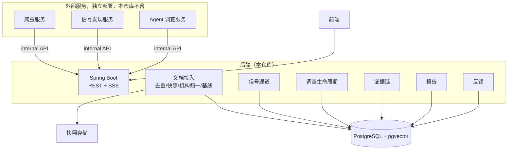
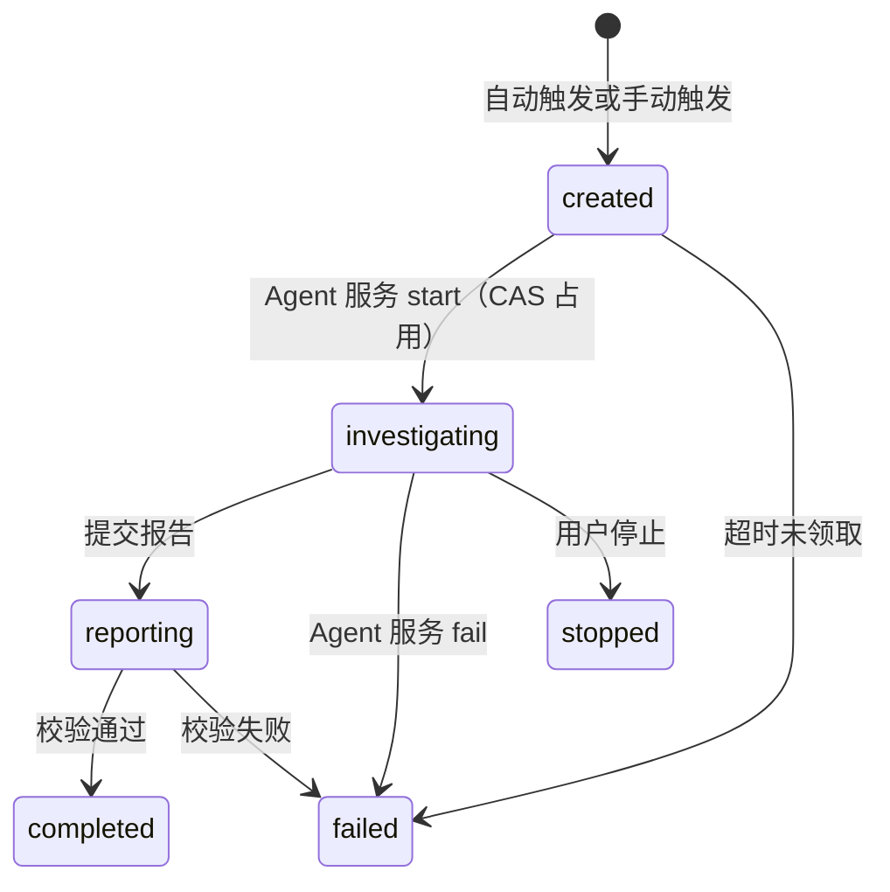
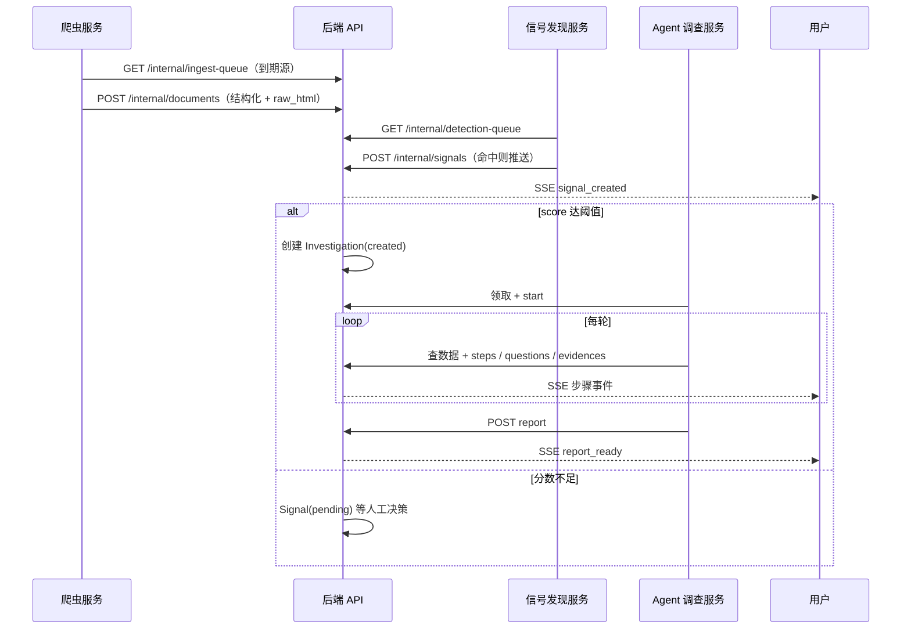

# 后端架构

## 1. 目标与约束

系统覆盖"监控 → 信号 → 调查 → 报告"链路，以招投标商机发现为首个场景。两条约束直接影响架构：

1. 深度调查（LLM）只用于少数信号，其余公告常规入库。信号检测就是成本闸门。
2. 报告里每个结论都要挂证据、可点回原文，事实和推测分开，结论不替代人的判断。

另外，信号发现和 agent loop 由别人做，本仓库只做后端平台（见下节）。

## 2. 范围

后端是一个自洽的数据与流程平台，单机 docker-compose 部署。爬虫服务、信号发现服务、Agent 调查服务是独立仓库、独立部署的外部服务，通过内部 HTTP API 接入：

- 调用方向只有一个：外部服务调后端。后端不调用它们，不知道它们用什么语言、部署在哪。
- 后端给的是数据契约（JSON 格式定义），不是代码契约。没有插件、没有共享代码。
- 不变量在后端强制：状态机流转、轮次和预算上限、证据引用校验都在 API 层做，外部服务写错了最多收到 4xx，不会弄脏数据。

| 外部服务 | 它做什么 | 用的接口（api-design.md §9） |
| --- | --- | --- |
| 爬虫服务 | 轮询到期的信息源，抓取页面并解析，推送结构化文档 | ingest-queue / documents / ingest-runs |
| 信号发现服务 | 轮询待检测文档，跑检测算法 | detection-queue / signals / scan-complete |
| Agent 调查服务 | 领取调查任务，跑调查循环，产出报告 | 领取 / start / context / steps / questions / evidences / report / complete / fail；查数据直接用 /documents、/organizations |

外部服务没接入时，后端照常跑：没有新文档、没有新信号，调查停在 created。

## 3. 总体架构



分四层：接入层（Spring Boot，用户走 JWT，外部服务走 X-Internal-Key）、服务层（各领域服务）、数据层（PostgreSQL + 快照存储）、少量定时任务（created 调查超时清理、回测数据集导出）。抓取与解析不在后端。

## 4. 模块设计

### 4.1 文档接入（ingest）

抓取和解析在外部爬虫服务里，后端只做接入：

- 到期判定：sources 表存每个源的 cron 和私有配置（adapter 名、URL 模板、选择器）。`GET /internal/ingest-queue` 返回当前到期的源（含全部配置），爬虫服务轮询领取。重复领取无害，入库去重会兜底，所以不需要分布式锁。
- 落库：`POST /internal/documents` 批量推送解析好的文档（含 raw_html）。后端做 URL 归一、content_hash 去重、raw_html 存快照、机构名归一并 upsert organizations（org_name 字符串进来，org_id 出去）、入库、重算该单位的 org_stats。新文档 signal_scanned=false，等信号服务来拉。
- 运行报告：`POST /internal/ingest-runs` 上报本次抓取统计和错误，后端更新 source 的 last_run_status 和 health（连续失败自动降级，错误记 ingest_errors）。

给爬虫服务的实现参考（坑都在它那边）：政府站多 GBK 编码；省级平台多 JS 渲染，先找内部 JSON 接口，别急着上无头浏览器；金额和日期格式五花八门（325万 / 3,250,000元 / 2026年9月24日），解析函数自己留着；每源限速 1 秒 1 个请求左右，单条失败跳过不阻塞批次。

### 4.2 信号（signals）

后端只做通道：

- 基线统计：org_stats 按单位 × 类别维护滚动窗口的 count / mean / std / P95 / 频次，纯 SQL，不含判断逻辑，是检测算法的输入。
- 落库：接收 POST /internal/signals 推来的 hits 和 score，写 signals 表（记下命中的规则和版本），发 SSE。
- 触发：score 达到配置阈值就自动建一条 Investigation（status=created），等外部 Agent 服务领取；不到阈值就 pending 等人工决策。
- 人工决策：确认或忽略（忽略必须填理由），写 feedback_events，给回测当标注。
- 规则管理：signal_rules 的版本化存储和启停（admin API）。参数内容是外部服务和回测产出的，后端只管存。

检测算法本身在外部信号服务里。它拿文档的接口（detection-queue）会把基线和关注画像一起返回，它不需要查任何别的东西。

研究起点假设（供信号服务参考）：金额异常（对单位历史基线的 z 分数）、频率突增、语义匹配（文档向量和关注方向画像的相似度）、组合提分。

### 4.3 调查（agent）

后端不跑 agent loop。外部 Agent 服务领取 created 状态的调查，通过内部 API 驱动全过程：提问、选工具、查证、反思的循环逻辑全在它那边。后端负责：

- 状态机：流转在 API 层校验，非法转移返回 40901。created 超时没人领取，定时任务标 failed。



- 留痕：steps / questions 落库，工具调用作为 steps 的一种类型（tool_call）由外部服务上报。step 的 seq 就是 SSE 的事件 id，断线按 Last-Event-ID 补发。前端的时间线和"为什么查这个"都从这两张表来。
- 预算：steps 带 token_usage，后端累加。超轮次或超预算的写入直接拒绝（42201），除提交报告和收尾外。
- 工具是外部服务自己的事：它把后端的数据接口（/documents、/organizations）和它自己接的外部源封装成自己的工具；产出经 evidences 接口登记，未登记的证据不能进报告。
- 报告落库：校验 ReportDraft，claim 引用的证据必须已登记，否则整份拒收。

### 4.4 证据（evidence）

每条证据必须带来源 URL、标题、发布时间、获取时间、摘录，外部内容抓取时就存快照、算 hash。claim 和证据多对多挂接。事件图谱（events / entities / relations 三张表）由 Agent 服务在报告里抽取、后端校验落库。

### 4.5 报告与反馈

报告 = 摘要 + 结论条目（claims，分 fact / inference / speculation）+ 行动建议 + 消耗统计。用户的确认、忽略、采纳都写 feedback_events。回测数据集由后端导出，评估在外部做，结果写回，胜出的参数生成新版本规则，管理端审核生效。

### 4.6 提示词与算法资产的归属

后端不存提示词，存的是提示词的输入（原料）与输出（产物）：

| 资产 | 归属 | 与后端的界面 |
| --- | --- | --- |
| 抓取解析规则 | sources.config（admin 配置） | ingest-queue 下发给爬虫服务 |
| 检测算法与参数 | 算法在信号服务；参数在 signal_rules.params（回测产出，后端版本化存储） | detection-queue 连同 org_stats、关注画像一并下发；命中经 signals 回传 rule_id + rule_version |
| 调查提示词（提问/选工具/反思/成文） | Agent 调查服务自己的仓库，自行版本管理 | 后端经 context 供给原料，经 steps / evidences / ReportDraft 接收结构化产物，全程不见提示词 |

版本留痕：信号侧用 signals.detector 标识算法/提示词版本；Agent 侧建议在 start 后的第一个 step 的 payload 里带 agent_version（载荷自由，契约不变）。若未来要把提示词集中到平台管理（prompt_templates 版本化表），属范围变更，须先改 AGENT.md 边界再动契约。

## 5. 关键流程



## 6. 部署

```yaml
services:
  api:        # Spring Boot jar：REST/SSE + 定时任务，单实例
  postgres:   # pgvector/pgvector:pg16
```

快照原型期存本地磁盘，目录挂卷即可，之后可换 MinIO。爬虫和两个研究服务都不在本 compose 里，它们只需要能访问 api 的 /internal/* 端点。后端要多实例部署时，用 ShedLock 防定时任务重复执行，SSE 广播和缓存引入 Redis。

本地调试与服务器部署同一套 compose，差异只进环境变量与 override 文件：本地常只起 postgres（api 在 IDE 里跑 local profile + devtools 热重载），服务器用 prod override（restart: unless-stopped、postgres 端口不暴露公网、nginx/caddy 做 TLS 且对 SSE 关缓冲）。环境差异项（DB 口令、JWT 密钥、INTERNAL_API_KEY、快照目录、时区）一律 .env 注入，.env 不入库。骨架在 S1 即部署服务器一次（backlog E0-5），部署风险不积压到最后。

## 7. 迭代顺序

按 docs/backlog.md 的冲刺计划执行（故事、验收标准、DoD、开放问题都在那里，此处不重复）。每个冲刺结束系统可演示，里程碑与史诗一一对应：

| 里程碑 | 史诗 | 冲刺 | 可演示状态 |
| --- | --- | --- | --- |
| M0 走通骨架 | E0 | S1 | 一键环境、认证、CI |
| M1 数据底座 | E1 | S2–S3 | 爬虫三接口 + 文档检索 |
| M2 信号通道 | E2 | S4 | 检测三接口 + 信号决策 + 自动触发 |
| M3 调查生命周期 | E3 | S5 | 状态机 + 留痕 + SSE + 预算 |
| M4 证据与报告 | E4 | S6 | 证据链 + 报告 + 导出 |
| M5 反馈与看板 | E5 | S7–S8 | 反馈闭环 + 看板 + 回测 |
| R 外部服务（并行） | — | S2 起随时联调 | 契约冻结，种子数据 + swagger 即联调环境 |

演示兜底：scripts 里带一份示例数据（一条大额医疗 AI 招标引发调查的完整链路样本），外部服务没接入也能演示全部页面。

## 8. 模式对照（2026-10 复核业界实践后的取舍记录）

| 业界模式 | 本项目对应做法 | 取舍 |
| --- | --- | --- |
| 模块化单体（Spring Modulith / ArchUnit 边界测试） | 按 ingest / signals / agent / evidence / report / feedback 分包 | 结构本身已采用；边界验证测试作为 C 级增强（backlog E0-6，模块长全后启用） |
| 事务性发件箱（transactional outbox） | SSE 事件可从 steps / signals 业务表按 Last-Event-ID 回放 | 不建 outbox 表——事件源即业务表，回放能力更强；只要求发布在事务提交后（afterCommit） |
| Agent 持久化执行 / 检查点（durable execution） | 外部服务无状态，全部状态在库，重启后从内部 API 重放恢复 | 等价的数据库变体，且把非确定性（LLM/工具）隔离在仓库边界外；不引入 Temporal / Restate |
| 混合检索（BM25 + 向量 + RRF 融合） | keyword（GIN 全文）与 semantic（HNSW）双路，RRF 融合排序 | 纯 SQL 实现零新依赖（backlog E1-6） |
| 契约即代码 / 破坏性变更门禁 | api-design §9 冻结 + §11 变更记录 | CI 跑 oasdiff 破坏性检测，把流程变成机器强制（backlog E0-2） |
| 事件溯源 / CQRS 全套 / CDC（Debezium）/ 消息队列 | org_stats 即增量维护的读模型；无 broker，SSE 内存广播 + 表回放 | 明确不做：单实例原型，上述机制已覆盖一致性需求，引入即冗余 |
