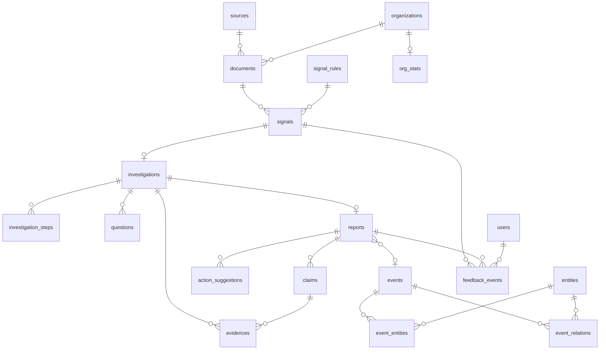

# 数据模型

PostgreSQL 16（pgvector 扩展）。主键统一为带前缀的 ULID 字符串（`doc_01H...`）。易变结构（规则参数、命中明细、步骤载荷）用 JSONB。

信号发现和 agent loop 是外部服务，它们自己不存状态，全部状态在下面的表里，重启后从内部 API 重放恢复。

## 1. ER 总览



## 2. 表

### users

| 列 | 类型 | 说明 |
| --- | --- | --- |
| id / email / password_hash / name | | email 唯一，密码 pbkdf2（迭代数按 OWASP 建议） |
| role | VARCHAR | admin / analyst / viewer |

### sources（信息源）

| 列 | 类型 | 说明 |
| --- | --- | --- |
| name / type / url | | type: web_page / api / rss |
| adapter | VARCHAR | 适配器名 |
| schedule_cron | VARCHAR | 采集计划 |
| config | JSONB | 适配器私有配置 |
| enabled / health / last_run_at / last_run_status / consecutive_failures | | health: ok / degraded / down;consecutive_failures 供 D3 降级阈值计数（成功清零） |

抓取与解析在外部爬虫服务，本表只存配置与运行状态（到期判定在后端）。

### ingest_errors（采集失败记录）

source_id、url、stage（fetch/normalize/dedup/persist）、error、occurred_at。由爬虫服务经 POST /internal/ingest-runs 的错误报告写入。

### organizations（单位）

name（规范化）、aliases（JSONB 归一别名）、type（buyer/supplier/gov）、uscc、region。

### documents（统一信息库，核心大表）

| 列 | 类型 | 说明 |
| --- | --- | --- |
| source_id | FK | |
| doc_type | VARCHAR | announcement / policy / news |
| title / content_text | | 正文供全文检索 |
| org_id | FK | 采购单位，可空 |
| amount | NUMERIC(18,2) | 元，可空 |
| publish_date / deadline | DATE | |
| region / category | VARCHAR | |
| url | VARCHAR | 归一化后唯一 |
| raw | JSONB | 源站原始字段 |
| content_hash | VARCHAR | SHA-256，唯一，去重键 |
| snapshot_key | VARCHAR | 快照对象键 |
| embedding | vector(512) | 供 /documents 的 semantic 检索和外部信号服务的语义匹配 |
| signal_scanned | BOOLEAN | 检测幂等位，detection-queue 的取数标记 |

索引：(doc_type, publish_date desc)、(org_id, publish_date desc)、(region, category)、全文 GIN、向量 HNSW、url 和 content_hash 唯一。

### org_stats（基线统计）

复合主键 (org_id, category)。window_days、sample_count、amount_mean / amount_std / amount_p95、freq_mean_30d、last_doc_at。文档入库时增量重算，检测接口下发用。

### signal_rules（版本化规则）

主键 id，UNIQUE(id, version)。name、type（amount_anomaly / frequency_burst / semantic_match / composite）、params（JSONB，内容由外部服务和回测产出）、weight、enabled（同 id 只有一个版本生效）、backtest_result（JSONB）。

### signals

| 列 | 类型 | 说明 |
| --- | --- | --- |
| document_id / org_id | FK | |
| detector | VARCHAR(100) | 推送方标识，幂等键成员 |
| hits | JSONB | `[{rule_id, rule_version, rule_type, weight, detail}]`，外部服务推来的 |
| score | NUMERIC(4,3) | 外部产出，后端只消费 |
| status | VARCHAR | pending / investigating / confirmed / dismissed，CAS 更新 |
| investigation_id | FK | 自动/手动开调查后回填 |
| decided_by / decided_at / decision_reason | | 人工决策留痕，dismiss 必填 reason |

UNIQUE (document_id, detector, hits) 是推送幂等键：同文档同检测器同命中重复推返回已有 signal_id。jsonb 相等忽略键序，但要求键集一致（值为 null 的键也算键）。索引 (status, created_at desc)、(org_id)、(score desc)。

### investigation_policies（调查策略）

单行配置表（id 恒为 1，CHECK 约束保证）。auto_investigate_threshold（默认 0.85，score ≥ 阈值自动开调查）、max_concurrent_investigations（默认 3，start 时生效——D14：created 排队不限量，超出上限的 start 返回 40901）、default_max_rounds（默认 8）、default_token_budget（默认 60000）、updated_at。admin 经 GET/PUT /admin/investigation-policies 读写，PUT 全量必填、即时生效于后续自动触发。

### watch_profiles（关注画像）

id（wpr_ 前缀）、name（唯一，如"医疗AI"，semantic_match 的 detail.profile 引用）、enabled（默认 true）、note。admin 经 /admin/watch-profiles 维护；detection-queue 每项内嵌"启用中的画像名"列表（D13：单独建表而非存 policies 的 JSONB，可查可索引）。V3 种子预置：医疗AI / 数据平台 / 医疗网络安全。

### investigations（调查）

| 列 | 类型 | 说明 |
| --- | --- | --- |
| signal_id | FK，唯一 | 一信号一调查 |
| status | VARCHAR | created / investigating / reporting / completed / failed / stopped |
| current_round / max_rounds | INT | |
| token_budget / token_used | INT | |
| cost_estimate | NUMERIC | |
| judgment | TEXT | 外部服务最近一次上报的判断快照 |
| error / started_at / finished_at | | |

### investigation_steps（步骤留痕，V4）

id（ist_ 前缀）、investigation_id、seq（从 1 起，UNIQUE(investigation_id, seq)，即 SSE 事件 id）、round、type（question/tool_select/tool_call/reflection/status_change，由 event 名映射）、content（JSONB，`{event, ...载荷}` 扁平存放，SSE 按 content.event 还原事件名、载荷作 data）、token_usage（该步消耗，累加进 investigations.token_used）、created_at。工具调用没有单独的表：外部服务把它作为 tool_call 类型的 step 上报。

派生步骤：investigation_started（start 接口落，round=0）、budget_update（token_usage>0 的步骤提交后由后端补一条，载荷 {token_used, token_budget}）、investigation_stopped / investigation_failed（stop / TTL 清理落）。派生步骤同样可 SSE 补发——重连不丢预算与状态事件的语义由此成立。

### questions（待确认问题，V4）

id（q_ 前缀）、investigation_id、text（≤1000）、raised_in_round、status（open/clarified/unresolved/abandoned）、answer_summary、evidence_ids（JSONB 数组，引用必须属于本调查的 evidences，未登记 → 42201）、created_at / updated_at。POST /internal/questions 建 open 问题；PATCH 推进状态与答案。

### evidences（证据，V4 建表、E4-1 加登记 API）

| 列 | 类型 | 说明 |
| --- | --- | --- |
| source_type | VARCHAR | announcement / policy / news / company_record / web / internal_stat |
| title / url / excerpt | | |
| published_at | TIMESTAMPTZ | 来源自身的发布时间 |
| fetched_at | TIMESTAMPTZ | 系统获取时间，必填 |
| content_hash / snapshot_key | | 快照防篡改 |
| doc_id | FK | 来自本库时回指 |
| investigation_id | FK | 由哪次调查采集（E3 阶段仅作引用归属校验目标） |

### entities / events / event_entities / event_relations（事件图谱）

- entities：name、type（org/project/product/region/policy）、ref_org_id、aliases。
- events：title、type（construction_wave/policy/procurement/...）、summary、start_date、status（ongoing/closed/speculative）、created_by_report。
- event_entities：(event_id, entity_id) 复合主键，role（participant/object/scope/beneficiary）、since。
- event_relations：source_type/source_id、target_type/target_id（节点可为事件、主体或证据）、relation（前置/参与/佐证/互证/同属）、evidence_id、since。

图谱数据由 Agent 服务在 ReportDraft 的 event_extraction 里抽取，后端校验落库。

### reports / claims / evidence_links / action_suggestions

- reports：investigation_id（唯一）、signal_id、event_id（可空）、title、summary、status（draft/published）、meta（JSONB，轮次/工具数/token/费用）。
- claims：report_id、seq、text、nature（fact/inference/speculation）、confidence。
- evidence_links：(claim_id, evidence_id) 多对多，relation（直接依据/背景/互证）。
- action_suggestions：report_id、text、priority、adopted_at（反馈回填）。

### feedback_events / backtest_runs

- feedback_events：user_id、target_type（signal/report/claim/suggestion）、target_id、action（confirm/dismiss/adopt/reject/flag_false_positive）、reason。
- backtest_runs：rule_id、param_grid、date_from/date_to、status、result（JSONB）。评估在外部执行，后端出数据集、存结果。

## 3. 数据流

```
采集: source → documents（快照 + embedding）→ org_stats 重算
信号: documents → GET /internal/detection-queue → 外部信号服务 → POST /internal/signals → signals
      → score 达阈值 → investigations(created)
调查: 外部 Agent 服务查数据（/documents、/organizations）→ steps（含工具调用记录）/ questions / evidences
报告: ReportDraft → reports + claims + evidence_links + suggestions + 事件图谱
反馈: 用户操作 → feedback_events → 回测数据集 → 新版本 signal_rules
```

## 4. 容量与迁移

原型期按 10 个源、日增 5 千文档估算，documents 年增约 180 万行，单实例够用。steps / tool_calls 随调查量线性（每次 20~40 步），先不分区。

Flyway 迁移：首个迁移建 pgvector 扩展并建全部表；signal_rules 与 evidence_links 只增列不改列。种子数据预置三个默认规则（version=1）。
